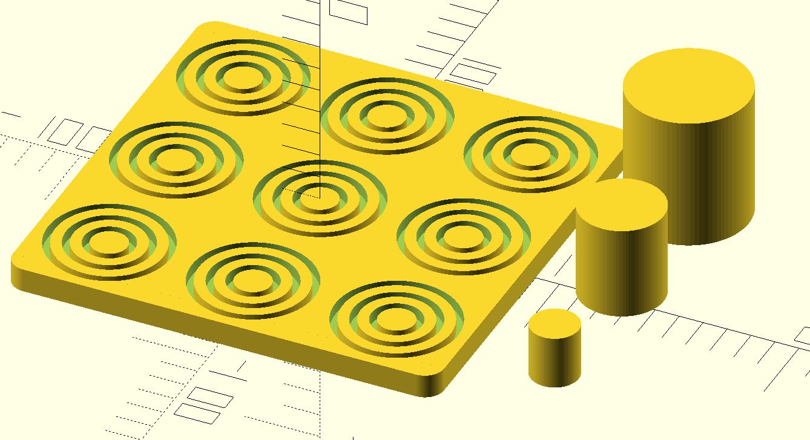

# Thimble-cup-bucket

Thimble-cup-bucket is a variant of tic-tac-toe with a much deeper gameplay
that is super fun!

The rules, in brief:
* Like in tic-tac-toe, the game is played on a 3-by-3 board, the objective
  is to get three in a row horizontally, vertically, or diagonally.
* Players alternate in placing a piece on one of the 9 available spaces. If
  no piece can be placed (when all pieces are placed, or all remaining
  pieces have no free space to put the piece), players instead move a piece
  from one space to another.
* Making a move is mandatory, even if it causes the player in turn a
  disadvantage.
* A piece can be placed on an empty space, or on top of a smaller piece
  (same or opposite colour).
* When moving a piece from one spae to another, the moving piece may reveal
  a piece of the opposite colour. When this happens, and it results in a
  3-in-a-row to appear on the board for the other side, the moving player
  loses the game, even if completing the move would have blocked the
  3-in-a-row again.
  
Have fun ;-)

